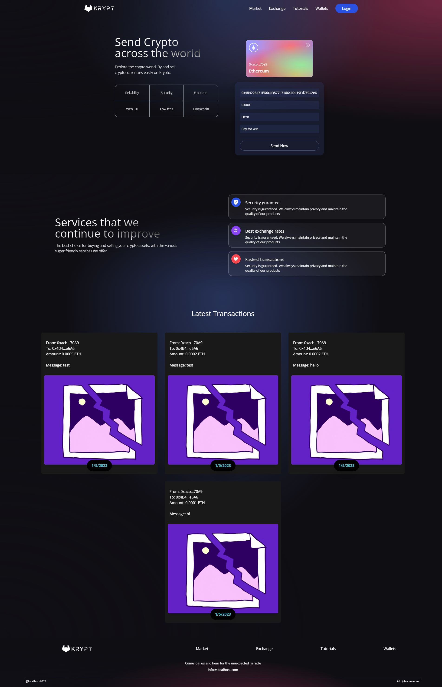

# Krypt - Web 3.0 Blockchain and Smart Contract Application

## Description

This is a code from the corresponding [**video tutorial**](https://youtu.be/Wn_Kb3MR_cU) in [JavaScript Mastery](https://www.youtube.com/@javascriptmastery) on Youtube.

## How to deploy smart contract

Update ***networks url with API key and account private keys*** in file ./smart_contract/hardhat.config.js

```bash
npm install -g pnpm
cd ./smart_contract/
pnpm install
pnpm exec hardhat run scripts/deploy.js --network goerli
```

## How to run web application

```bash
npm install -g pnpm
cd ./client/
pnpm install
pnpm run dev
```

## Web application screenshot


